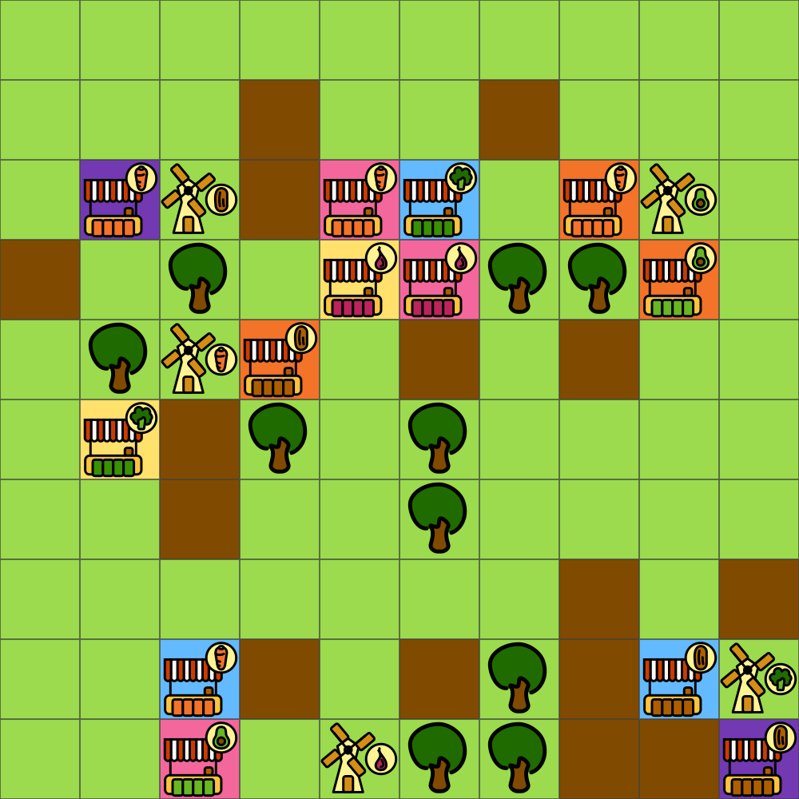
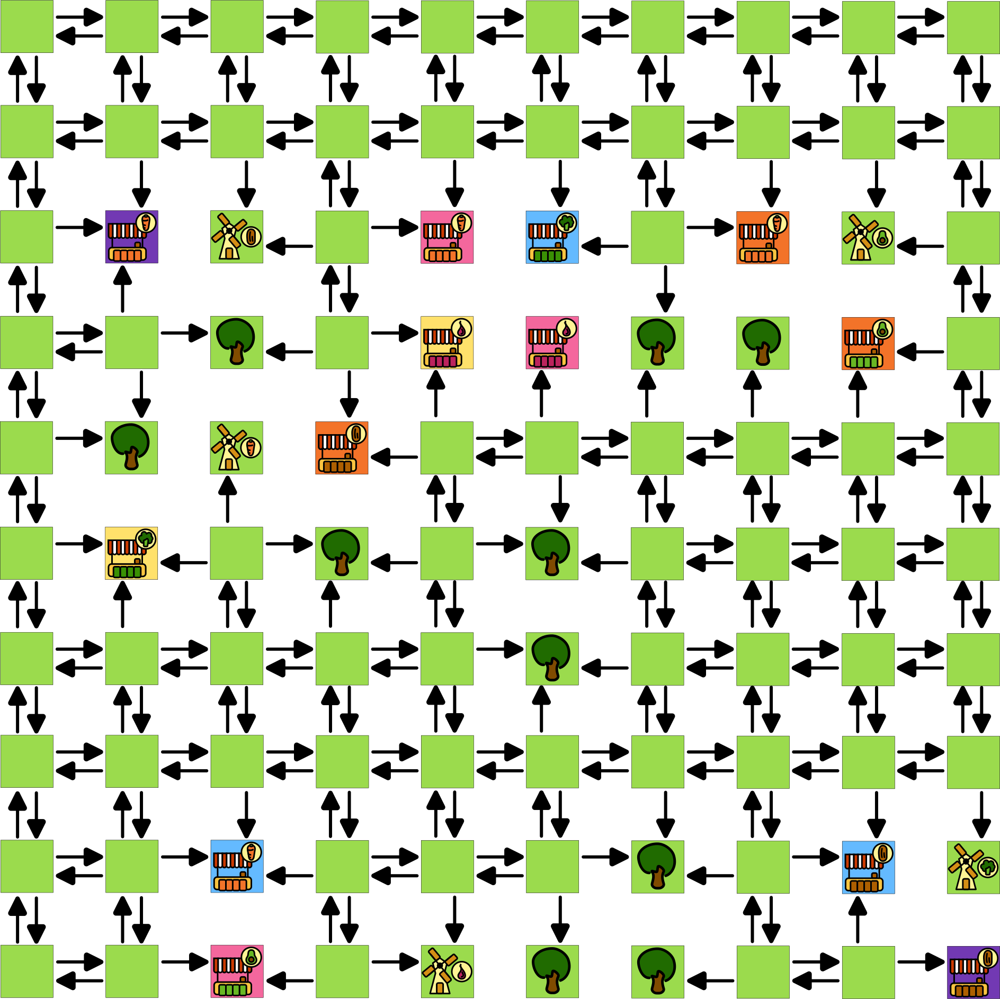
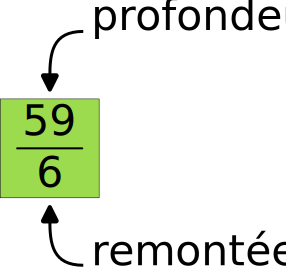
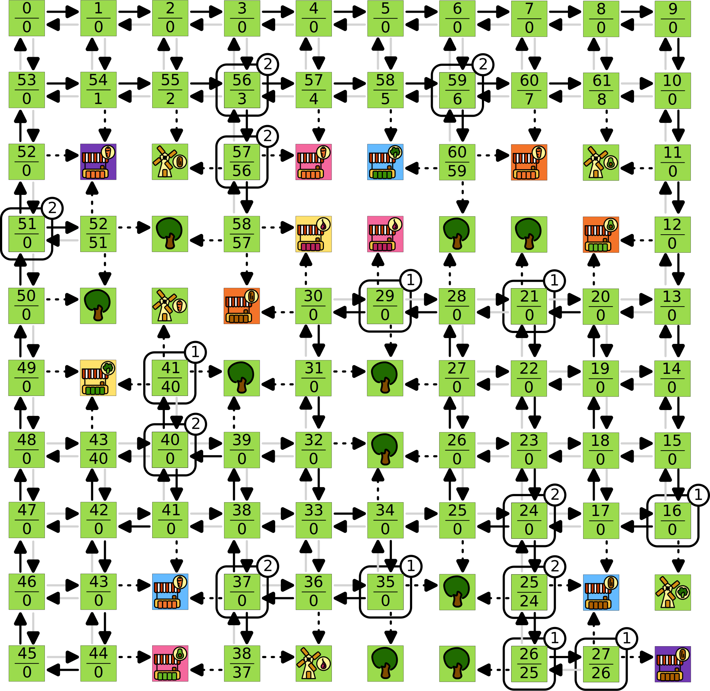

# Projet Fresh Fish

Fresh Fish est un jeu de Friedemann Friese édité par 2F-Spiele en 2014. Dans ce
jeu, des éléments sont placés sur un plateau, et des routes apparaissent
automatiquement pour relier ces éléments entre eux. Le but de ce projet est dans
un premier temps d'écrire un programme permettant de réaliser automatiquement le
placement des routes. Dans un second temps, il faudra compter les points des
joueurs en fin de partie. Il sera enfin possible d'étendre ce travail pour
réaliser un joueur automatique.

## Placement des routes

### Règles du jeu

#### But du jeu

Les règles présentées ici sont une légère variation des règles classique du jeu
Fresh Fish pour simplifier le problème. Si vous le souhaitez, vous pouvez 
[consulter les vraies règles](https://cdn.1j1ju.com/medias/b0/42/a0-fresh-fish-rulebook.pdf).
Dans ce jeu, les joueurs jouent des marchands qui cherchent à vendre différents 
types de denrées :

* A -- des avocats
* B -- des brocolis
* C -- des carottes
* D -- des dattes
* E -- des échalotes

<center>
    
</center>

Ces denrées sont produites au niveau de producteurs, et le but des marchands est
de proposer les denrées les plus fraîches possibles en plaçant leurs boutiques
le plus près possible des producteurs correspondants. Chaque joueur devra donc
placer une boutique pour chaque type de denrée.

<center>
    
</center>

#### Aménagements

Le jeu se joue sur une grille de 10 cases de côté. Lors de la mise en place, les
producteurs sont placés sur cinq cases quelconques de la grille. Les joueurs
vont ensuite peupler le reste des cases en jouant ensuite chacun leur tour. Nous
ne détaillerons pas ici le détail des règles de réservation et de placement des
éléments qui ne sont pas importantes à ce stade. Les joueurs vont pouvoir placer
deux types d'aménagements :

* leurs boutiques
* des arbres

Le point important est qu'il faudra toujours à tout moment dans la partie que
toutes les cases aménagées soient accessibles. Si on imagine une personne ne
pouvant se déplacer que sur les cases vides, cette personne devra pouvoir se
rendre à côté de tous les aménagements placés sur le plateau. Au fur et à mesure
de la partie, il ne devient plus possible d'ajouter d'aménagements sur certaines
cases. Ces cases deviennent des routes, en brun sur l'image ci-dessous.

<center>
    
</center>


Ainsi après chaque aménagement, il faut examiner toutes les cases libres pour
déterminer si certaines doivent devenir des routes. Cette phase est assez
complexe à réaliser, et c'est ce que nous nous proposons d'automatiser lors de
cette première phase.

### Modélisation sous forme de graphe

Le problème peut être modélisé sous la forme d'un graphe orienté. Chaque case du
plateau correspond à un sommet du graphe. Une case vide ou une route peut
accéder aux quatre cases voisines. Une case aménagée ne peut accéder à aucune
autre case.

<center>
    
</center>

#### Travail à réaliser

Le code initial fournit une classe Plateau vous permettant d'initialiser un
plateau de la taille souhaitée, d'aménager les cases et de l'afficher. Sa
déclaration est dans le fichier `plateau.hpp`. Pour vous ajouter en
lisibilité, le fichier `constantes.hpp` contient quelques utilitaires pour
manipuler les aménagements des cases. Enfin le fichier `position.hpp` définit la
notion de position sous forme de coordonnées 2D. Notez que ces coordonnées
utilisent la convention "ligne, colonne", donc `{0,0}` correspond au coin en
haut à gauche et `{0,9}` au coin en haut à droite. Le fichier de test
correspondant à ce travail est le fichier `test_graphe`.

Pour la compilation, vous avez deux possibilités :

* un `Makefile` est disponible dans le dossier `src` :
  - naviguez dans le dossier `src`
  - utilisez la commande `make`
* un fichier `CMakeLists.txt` est fourni pour `cmake` :
  - créez un répertoire `build` à la racine
  - allez dans le répertoire `build` et lancez 
  `cmake .. -DCMAKE_BUILD_TYPE=DEBUG`
  - compilez via `make`

##### Positions voisines

Complétez dans le fichier `position.cpp` l'implémentation de la fonction

```
Position voisine(const Position& pos, int index) ;
```

Cette fonction permettra d'énumérer les positions voisines d'une position :

* pour i = 0 celle d'au dessus
* pour i = 1 celle de droite
* pour i = 2 celle d'en dessous
* pour i = 3 celle de gauche

On ne se préoccupe pas ici des dimensions du plateau, ainsi la position 
`{-1, 3}` est attendue pour l'appel `voisine({0,3}, 0)`.

Si tout se passe bien, la fonction d'affichage en console du plateau de jeu
devrait se mettre à fonctionner, et vous devriez voir apparaître le plateau
suivant :

```
+---+---+---+---+---+---+---+---+---+---+
|                                       |
+   +   +   +   +   +   +   +   +   +   +
|    {:}                                |
+   +   +   +   +   +   +   +   +   +   +
|                                       |
+   +   +   +   +   +   +   +   +   +   +
|                            +A+        |
+   +   +   +   +   +   +   +   +   +   +
|                                       |
+   +   +   +   +   +   +   +   +   +   +
|                                       |
+   +   +   +   +   +   +   +   +   +   +
|                                       |
+   +   +   +   +   +   +   +   +   +   +
|                                       |
+   +   +   +   +   +   +   +   +   +   +
|        $E$                            |
+   +   +   +   +   +   +   +   +   +   +
|                                       |
+---+---+---+---+---+---+---+---+---+---+
```


##### Consultation des tuiles du plateau

Dans le plateau, les informations des tuiles sont stockées dans une objet de
type `std::map<Position, Tuile>` qui associe à une position les données de la
tuile associée. Allez consulter 
[la documentation de référence de cette structure de données](https://en.cppreference.com/w/cpp/container/map),
en particulier les méthodes

* `find`
* `at`

qui vous permettront d'y accéder. Pour démontrer votre compréhension de cette
structure et du graphe, ajoutez dans le fichier `test_graphe.cpp` quelques test
qui listeront pour quelques cases bien choisies :

* les positions voisines ;
* si ces positions correspondent à des cases ou non ;
* si elles sont sur le plateau, leur aménagement ;
* si l'arc entre la case et sa voisine existe dans le graphe.

Vous ne modifierez plus le fichier `test_graphe.cpp` par la suite.

### Algorithme naïf

Une première approche simple pour déterminer si une route doit apparaître
consiste à aménager cette case, puis réaliser un parcours depuis une case libre
restante. Si ce parcours est en mesure d'atteindre toutes les cases aménagées,
alors il n'est pas nécessaire d'ajouter de route sur la case. On rappelle ici
l'algorithme classique d'un parcours en profondeur :


#### Travail à réaliser

Dans le fichier `plateau.cpp`, complétez la fonction `placer_routes` qui est
pour l'instant vide. Cette fonction est appelée à chaque fois qu'un aménagement
est placé sur le plateau. Vous pourrez utiliser les étapes suivantes :

* réalisez une boucle qui énumèrera les cases non aménagées du plateau ;
* pour chacune de ces cases, aménagez y un arbre, puis retirez le ;
* au moment où l'arbre est aménagé, cherchez une autre case non aménagée ;
* lancez un parcours en profondeur depuis cette autre case ;
* vérifiez que toutes les cases ont été visitées par le parcours ;
* si ce n'est pas le cas, ajoutez une route sur la case.

Vous pourrez tester votre implémentation via le fichier `test_routes.cpp`. Ce
test part d'un plateau vide puis ajoute des arbres sur des cases vides jusqu'à
ce qu'il n'y ait plus de cases vides. Le test initial teste délibérément sur un
petit plateau. Si votre implémentation fonctionne vous pourrez ensuite le faire
grossir. Vérifiez visuellement que toutes les cases sont bien accessibles.

### Algorithme  élaboré

L'algorithme naïf nécessite de réaliser un parcours du graphe pour chaque case
libre du plateau. Sachant que le but est de conserver toutes les cases
accessibles, un bon nombre de ces parcours visiteront toutes les cases du
plateau. Cet algorithme est donc quadratique en la taille du plateau. Nous
allons ici définir un nouvel algorithme qui identifie toutes les routes en un
seul parcours en profondeur depuis une case libre.

Lors de ce parcours, nous classifierons les arcs du graphe en trois familles.
Étant donné deux cases $u$ et $v$ reliées par un arc $u → v$, on dira que cet arc
est :

* une impasse si la case $v$ est aménagée ;
* utilisé si lors du parcours, la case $v$ est explorée depuis la case $u$ ;
* ignoré sinon.

Référez vous à l'algorithme du parcours en profondeur ci-dessus pour un rappel
sur ce que signifie « $v$ est explorée depuis $u$ ». Notez qu'un arc est une
impasse si $v$ est aménagée même si la case $v$ est explorée depuis $u$. Dans
l'illustration ci-dessous, les impasses sont en pointillés, les arcs utilisés
sont noirs et les arcs utilisés sont gris.

<center>
    
    <br/>
</center>

Nous associerons également à chaque case $u$ une *profondeur* $P(u)$. Pour un
parcours lancé à partir d'une case de départ $d$, la profondeur de $d$ est 
$P(d) = 0$. Ensuite, lorsqu'une case $v$ est poussée par une case $u$, la 
profondeur de $v$ est définie à partir de la profondeur de $u$ par la relation 
$P(v) = P(u) + 1$.

On définit enfin la *remontée* $R(u)$ d'une case $u$ comme la profondeur minimale
qu'il est possible d'atteindre depuis cette case en ne suivant que des arcs
utilisés puis un seul arc ignoré. Cette remontée peut être calculée au fur et à
mesure du parcours en profondeur. Lorsque le parcours traite une case $u$, sa
remontée est initialisée à sa profondeur : $R(u) ← P(u)$. Ensuite pour chaque arc 
$u → v$ considéré lors de l'exploration il peut arriver trois choses :

* si l'arc est utilisé, $R(u) ← \min \{R(u), R(v)\}$;
* si l'arc est ignoré, $R(u) ← \min \{R(u), P(v)\}$ ;
* si l'arc est une impasse, la remontée de la case reste inchangée.

Sur la figure ci dessous, la profondeur et la remontée sont fournies avec la
disposition suivante :

<center>
    
    <br/>
    <br/>
</center>

Le schéma ci-dessous propose un exemple de parcours en profondeur, avec les
données de profondeur et de remontée qui sont calculées sur chaque case. Le
parcours débute sur la case en haut à gauche. Sauf erreur, le parcours a été
réalisé en examinant les cases voisines dans l'ordre haut puis droite puis bas
puis gauche.

<center>
    
    <br/>
</center>

Muni de toutes ces données, une route apparaît sur la case $u$ si :

1. elle est la seule pouvant accéder à une case aménagée ;
1. elle n'est pas la case de départ et elle est à l'origine d'un arc $u → v$ utilisé 
  tel que $R(v) ≤ P(u)$ ;
1. elle est la case de départ et elle est à l'origine de plusieurs arcs utilisés.

Notez que le premier de ces trois critère nécessite de compter pour chaque case
aménagée le nombre de cases pouvant l'atteindre. Sur le schéma ci-dessus, les
routes apparaissent sur les cases encadrées, et le petit cercle donne la raison
pour laquelle la case devient une route.


#### Travail à réaliser

Sauvegardez votre fonction naïve par exemple avec le nom `placer_routes_naive`.
Ensuite implémentez la version élaborée. Vous pourrez utiliser les étapes
suivantes :

* réalisez un parcours en profondeur et calculer les profondeurs des cases ;
* calculez en plus les remontées des cases ;
* à partir de ces deux informations, déterminer les cases devenant des routes ;
* vérifiez que ces cases sont les mêmes que celles de votre algorithme naïf.


## Pour aller plus loin

Pour aller plus loin, le fichier `test_partie.cpp` et les fichiers `joueur.*` et
`partie.*` implémentent des parties complètes. Le joueur pour l'instant joue au
hasard et est donc totalement stupide.

### Calcul du score des joueurs

À la fin de la partie, un joueur cherche à avoir ses boutiques le plus près
possible des producteurs. Pour chaque boutique, il est possible de calculer le
plus court chemin dans le graphe vers le producteur correspondant. Le score d'un
joueur est la somme des longueur de ces chemins pour chacune de ses boutiques.
Selon le nombre de joueurs, une longueur maximale est appliquée (14 pour cinq
joueurs) : si un chemin a une longueur plus grande que ce maximum, le nombre de 
points sera ce maximum. Il peut arriver qu'un joueur ne soit pas en mesure de 
placer une boutique. Dans ce cas, la boutique se trouvera en fin de partie dans
le tableau `eliminees` du plateau. Pour ces boutique, la longueur du chemin
correspondant est le maximum possible. Pour gagner, un joueur doit avoir **un
score le plus petit possible**.

Implémentez le nécessaire pour calculer les scores des joueurs en fin de partie.
Les chemins pourront être déterminés en utilisant des parcours en largeur.
Réfléchissez bien au nombre de parcours nécessaires pour trouver tous les
chemins. Modifiez ensuite `test_partie.cpp` pour afficher le score des joueurs
et le vainqueur.

### Gérer les enchères

En début de partie, chaque joueur se voit normalement attribuer un budget de 15
pièces (voir [les vraies règles](https://cdn.1j1ju.com/medias/b0/42/a0-fresh-fish-rulebook.pdf)). 
Ces pièces lui servent à acheter les aménagement à placer aux enchères. En fin
de partie, chaque pièce restante diminue son score d'un point. Pour l'instant
les joueurs ne comptabilisent par leurs pièces, et misent systématiquement 0.
Ajoutez la gestion des pièces.

### D'autres joueurs

Comme expliqué, le joueur est pour l'instant stupide. À vous de rajouter le
nécessaire pour :

* permettre des joueurs humains ;
* rendre éventuellement le joueur automatique moins stupide.
